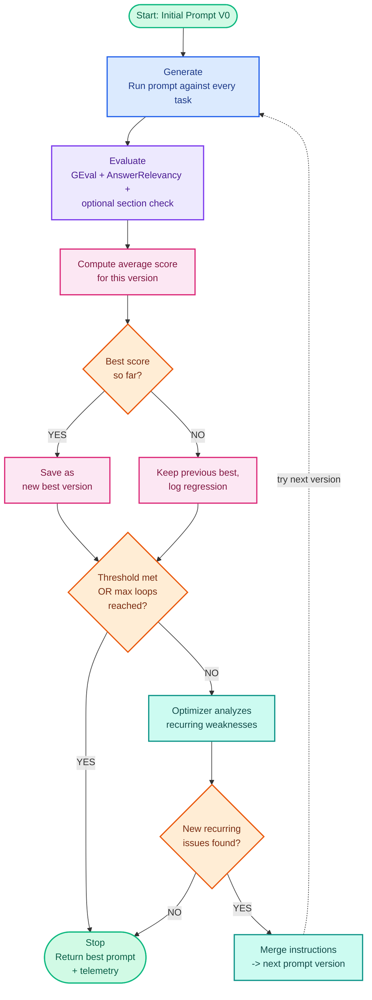

# Prompt Optimizer

A provider-agnostic prompt optimization pipeline powered by [LiteLLM](https://github.com/BerriAI/litellm) and [DeepEval](https://github.com/confident-ai/deepeval).

Give it an initial prompt, a set of tasks, and an evaluation rubric — it will generate responses, score them with an LLM judge, and automatically rewrite the prompt to fix recurring weaknesses across multiple optimization loops.

## Functionality

- **Provider-agnostic** — works with any LiteLLM-supported model (Gemini, Groq, OpenAI, Anthropic, on-prem Ollama, etc.) for both generation and judging, just by changing a model string.
- **On-prem / local model support** — point generation and/or evaluation at a local Ollama instance instead of a cloud API, with no code changes required.
- **Independent model routing** — generation and evaluation models are configured separately, so you can mix providers (e.g. generate locally, evaluate in the cloud) or use the same one for both.
- **Automated feedback loop** — generates responses, scores them, and rewrites the prompt to target only *recurring* weaknesses (not one-off mistakes).
- **Multi-loop optimization** — runs the generate → evaluate → optimize cycle for a configurable number of loops (`max_loops`), stopping early once a score threshold is met.
- **Regression-safe** — always keeps the best-scoring prompt version found so far, even if a later candidate performs worse; regressed candidates are logged but never become the new baseline.
- **Blended scoring** — combines a custom rubric (`GEval`) with a generic relevance check (`AnswerRelevancyMetric`), with configurable weighting between the two.
- **Deterministic section checks** — optionally verifies required sections/headings are present and in the correct order, independent of the LLM judge's leniency, with configurable score penalties.
- **Bounded instruction growth** — new optimizer instructions are merged and deduplicated into a capped bullet list each loop, instead of growing the prompt indefinitely.
- **Full telemetry** — tracks token usage (generation / judge / optimizer, separately and combined), timing per task, and per-task score deltas across every loop.
- **Prompt version history** — every prompt candidate tried (V0, V1, V2, ...) is retained and reported, alongside which version was ultimately selected as best.

## Prerequisites

- **Python:** 3.10+
- **Pip:** 26.1.2+

Check your versions:
```bash
python --version
pip --version
```

If pip is outdated:
```bash
python -m pip install --upgrade pip
```

## Installation

```bash
pip install litellm-prompt-optimizer
```

### Pinning dependencies (recommended)

`litellm` releases frequently, and newer versions can occasionally break compatibility (e.g. requiring a Rust toolchain to build from source on some platforms). To pin known-good versions and generate a reproducible lockfile:

```bash
pip install pip-tools
```

Create a `requirements.txt` file in your project root:
```
litellm==1.91.4
deepeval==4.1.2
python-docx
python-dotenv
litellm-prompt-optimizer
```

This produces a `requirements.txt` lockfile with exact, resolved versions for every dependency. Install from it with:
```bash
pip install -r requirements.txt
```

## Setup

1. Create a `.env` file in your project root with your model names and credentials:

    ```env
    # --- Model Routing Controls ---
    # Format for Cloud Providers: e.g., "gemini/gemini-2.0-flash", "groq/llama-3.3-70b-versatile", "gpt-4o", "claude-3-5-sonnet"
    # Format for On-Prem Ollama:   e.g., "ollama/llama3", "ollama/mistral", "ollama/codellama"
    GENERATION_MODEL_NAME=""
    EVAL_MODEL_NAME=""

    # --- Cloud Provider Credentials (Optional) ---
    GEMINI_API_KEY=""
    GROQ_API_KEY=""
    OPENAI_API_KEY=""
    ANTHROPIC_API_KEY=""

    # --- On-Premises Ollama Configuration (Required if using Ollama) ---
    # When targeting local infrastructure, specify your local connection endpoint.
    # Default Ollama address format: "http://localhost:11434" (or use your custom local network host IP)
    OLLAMA_API_BASE="http://localhost:11434"
    ```

    `GENERATION_MODEL_NAME` and `EVAL_MODEL_NAME` can independently point to different providers — e.g. generate locally with Ollama while evaluating with a cloud model, or vice versa. Only set the credentials relevant to the providers you're actually using; unused keys can be left blank.

2. Create a `config.json` describing your prompt, tasks, and evaluation rubric. This works with **any** generation/eval model — the structure below is provider-agnostic:

    ```json
    {
      "max_loops": 3,
      "eval_max_response_chars": 4000,
      "initial_prompt": "Your custom system prompt goes here. Use the placeholder {user_query} where the test tasks should be dynamically injected.",
      "optimizer_prompt": "Instructions telling the optimizer engine how to fix the prompt (e.g., 'Analyse the poorly-scoring tasks together. Find weaknesses that appear across multiple runs. Generate only new prompt instructions as bullet points.')",
      "evaluation_steps": [
        "Step 1: Check if the model followed formatting instruction X.",
        "Step 2: Verify that the information provided is complete and accurate.",
        "Step 3: Evaluate if the tone matches the required constraints."
      ],
      "required_sections": [
        {"name": "Expected Heading 1", "synonyms": ["heading 1", "alternative title 1"]},
        {"name": "Expected Heading 2", "synonyms": ["heading 2", "section 2"]}
      ],
      "tasks": [
        { "id": 1, "query": "First test input/scenario to run through your prompt." },
        { "id": 2, "query": "Second test input/scenario to evaluate performance variations." }
      ]
    }
    ```

    | Field | Required | Description |
    |---|---|---|
    | `max_loops` | No (default: 3) | Maximum number of generate → evaluate → optimize cycles to run. |
    | `eval_max_response_chars` | No (default: 4000) | Caps how much of a response is sent to the judge model, to avoid exceeding its token limit. |
    | `initial_prompt` | **Yes** | The starting prompt. Must contain the literal placeholder `{user_query}`. |
    | `optimizer_prompt` | No | Instructions guiding how the optimizer model should revise the prompt between loops. |
    | `evaluation_steps` | No (has a generic default) | A custom rubric passed to the LLM judge (GEval). Write one check per line, specific to your use case. |
    | `required_sections` | No | A deterministic (non-LLM) check that verifies specific headings appear in the response, in order. Each entry needs a `name` and a list of `synonyms` to fuzzy-match against. Skip this field entirely if your prompt has no fixed section structure. |
    | `section_penalty_per_missing` | No (default: 0.15) | Score penalty per missing required section. |
    | `section_penalty_for_order` | No (default: 0.05) | Score penalty if required sections appear out of order. |
    | `score_threshold` | No (default: 0.85) | Minimum average score to stop optimizing early. |
    | `geval_weight` / `relevancy_weight` | No (default: 0.7 / 0.3) | Blend weights between the custom rubric score and the generic relevance score. |
    | `tasks` | **Yes** | List of `{ "id": ..., "query": ... }` objects — the test inputs run through your prompt each loop. |

## Usage

```bash
prompt-optimizer
```

Optional flags:

```bash
prompt-optimizer --config config.json --env .env --output results.json
```

| Flag | Description |
|------|-------------|
| `-c`, `--config` | Path to config JSON (default: `config.json`) |
| `-e`, `--env` | Path to `.env` file (default: `.env`) |
| `-o`, `--output` | Save results as JSON (generated responses are terminal-only and never saved to disk) |

## Using on-prem Ollama

1. Install Ollama from [ollama.com/download](https://ollama.com/download).
2. Pull a model:
    ```bash
    ollama pull llama3
    ```
3. Make sure Ollama is running (default: `http://localhost:11434`).
4. In `.env`, set:
    ```env
    GENERATION_MODEL_NAME=ollama/llama3
    EVAL_MODEL_NAME=ollama/llama3
    OLLAMA_API_BASE=http://localhost:11434
    ```
    No API key is needed for Ollama.

Small local models can be less reliable at producing strictly valid JSON for the LLM judge than larger cloud models. If you see JSON-parsing errors from the evaluator, consider keeping generation local (`ollama/...`) while pointing `EVAL_MODEL_NAME` at a cloud model instead.

## How it works



1. **Generate** — the current prompt is run against every task using the generation model.
2. **Evaluate** — each response is scored by an LLM judge using your custom rubric, blended with a generic relevance check, plus an optional deterministic required-section check.
3. **Compare** — the new average score is compared against the best version seen so far. Regressions are kept on record but never become the new baseline.
4. **Optimize** — if the score is below threshold, an optimizer model analyzes recurring weaknesses and proposes new prompt instructions, which are merged into a bounded instruction set.
5. Repeat until the score threshold is hit or `max_loops` is reached.

The final result includes the best-scoring prompt version, its score, and full telemetry (token usage, timing, prompt version history).

## License

MIT